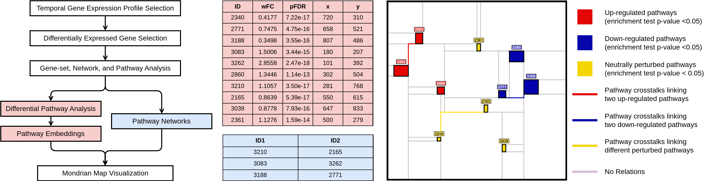
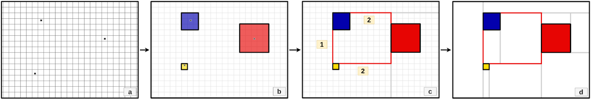
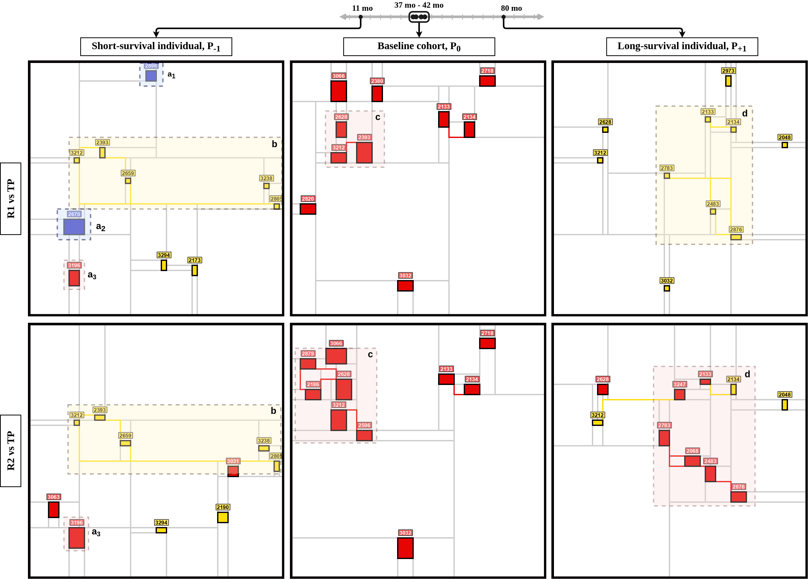

# Mondrian Abstraction and Language Model Embeddings for Differential Pathway Analysis

**Project Overview:**

This repository contains supplementary file, codebase and data generated for our paper titled "Mondrian Abstraction and Language Model Embeddings for Differential Pathway Analysis" which is currently under peer-review in a bioinformatics conference.

**Supplementary File:** The supplementary file to our paper can be found [here](https://github.com/aimed-lab/mondrian-map/blob/main/supplementary-file.pdf).

**Code:** The `notebooks` folder contains the following jupyter notebooks:

1. **clinical_data_analysis.ipynb**: Notebook for analyzing clinical data and suitable patient profile selection.
2. **data_preperation.ipynb**: Notebook for preprocessing data to make it suitable for Mondrian Map Visualization.
3. **pathway_embeddings.ipynb**: Here, we've experimented with different embedding techniques with different prompting strategies.
3. **visualize_mondrian_map.ipynb**: In this notebook, we've generated the Mondrian Maps in our Gliblastoma case study.

**Data:** All the datasets used and processed are stored in the `data` folder.

## Flow Chart


## Mondrian Map Generation


## Results


## Cite Us

If you find out tool useful, cite our [latest preprint](https://www.biorxiv.org/content/10.1101/2024.04.11.589093v2).

```
@article {AlAbir_MondrianMap,
	author = {Al Abir, Fuad and Chen, Jake Y.},
	title = {Mondrian Abstraction and Language Model Embeddings for Differential Pathway Analysis},
	elocation-id = {2024.04.11.589093},
	year = {2024},
	doi = {10.1101/2024.04.11.589093},
	publisher = {Cold Spring Harbor Laboratory},
	URL = {https://www.biorxiv.org/content/early/2024/08/19/2024.04.11.589093},
	eprint = {https://www.biorxiv.org/content/early/2024/08/19/2024.04.11.589093.full.pdf},
	journal = {bioRxiv}
}
```

## Contact

Reach us at [jakechen@uab.edu](mailto:jakechen@uab.edu) or [fuad021.edu](mailto:fuad021@uab.edu).

## License
Mondrian Map codebase is under MIT license.
